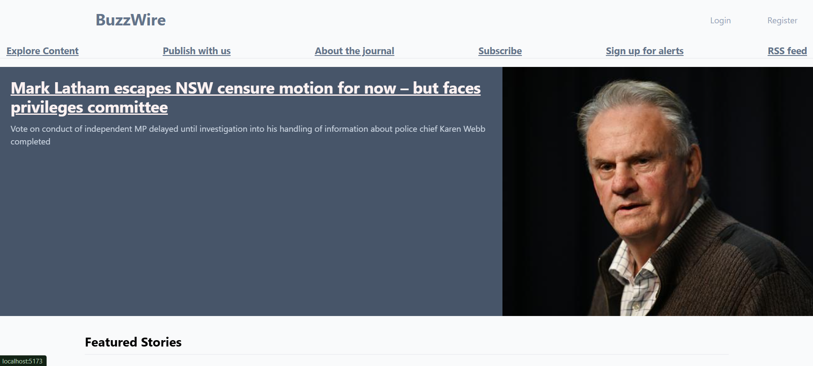
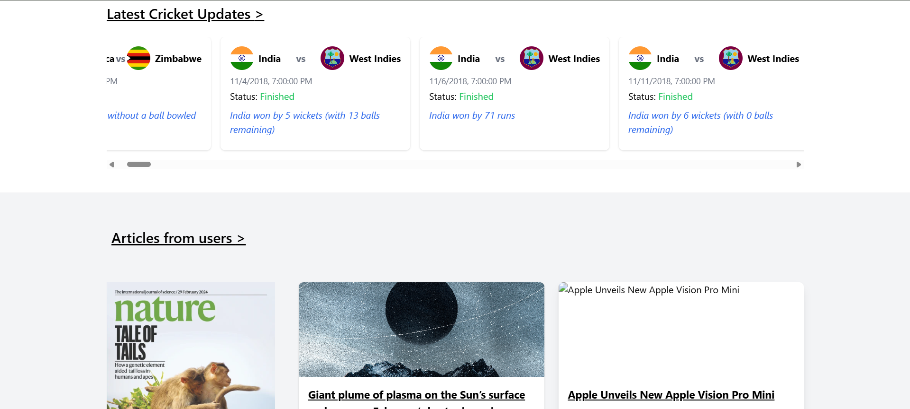

# 📰 BuzzWire

BuzzWire is a modern, full-stack **news & articles platform** that aggregates real-time news from multiple sources, displays sports updates, and allows users to publish their own articles.  
It combines **React (Frontend)**, **Node.js + Express (Backend)**, and multiple **third-party APIs** into a polished, responsive UI.

---

## 🚀 Features

### 🌐 Home Page Highlights
- **Breaking News Banner** — Fetches the top trending headline of the day from **The Guardian Open Platform API**.
- **Featured Stories** — Displays top news stories with images in a responsive card layout.
- **Sports Section (Cricket Updates)** — Live cricket fixtures from **SportMonks API** with:
  - Team names and logos (fetched & cached via backend to work around free-tier API limits).
  - Match status (Live, Finished, Upcoming).
  - Match notes and start time.
- **User Articles Section** — Displays articles created by registered users from the BuzzWire backend.

### ✍️ User Features
- User registration and login with **JWT authentication**.
- Create, edit, and delete personal articles.
- Upload cover images for articles.
- View a full article feed.

---

## 🛠️ Tech Stack

**Frontend**  
- React.js  
- Tailwind CSS (styling)  
- React Router (navigation)  
- Fetch API / Axios for API calls

**Backend**  
- Node.js  
- Express.js  
- MongoDB (Mongoose ORM)  
- JWT Authentication  
- API proxy routes for CORS handling

**APIs Integrated**  
- [The Guardian Open Platform API](http://open-platform.theguardian.com/) — Breaking news & featured articles.  
- [SportMonks Cricket API](https://docs.sportmonks.com/cricket/) — Live cricket scores & fixtures.  
- Custom BuzzWire API — Handles user articles & authentication.

---

## 📂 Project Structure
BuzzWire/
│
├── backend/ # Node.js + Express API server
│ ├── routes/ # API routes (user, posts, sports proxy)
│ ├── models/ # Mongoose schemas
│ ├── server.js # App entry point
│
├── frontend/ # React app
│ ├── src/components/ # Reusable UI components
│ ├── src/pages/ # Page components
│ ├── src/App.js # Routing


---

## ⚡ Installation & Setup

### 1️⃣ Clone the Repository
```bash
git clone https://github.com/your-username/BuzzWire.git
cd BuzzWire

Backend Setup

cd backend
npm install


Frontend Setup

cd frontend
npm install
npm start
```

### images

#  
#  
#  
# 